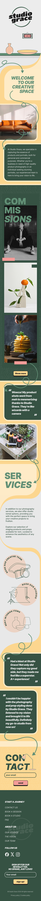

# Studio Grace

---

***This was a group assignment in the course Graphic design at the Front End Development program at Medieinstitutet Stockholm.***

In this project we made a design of a web aplication in Figma, and then switched design with another group. Our task was then to develop the design that we received from the other group.

The design we were to develop was an application for a photograph studio called Studio Grace. It's a design with many layers, rounded shapes and fun illustrations and animations. 

The challenge in this project was to get the correct position of all illustrations and components.

---

## Authors & Developers

- [@fannyestrom](https://github.com/fannyestrom)
- [@SaraGdbg](https://github.com/SaraGdbg)
- [@JohannaPri](https://github.com/JohannaPri)
- [@ReginaJM](https://github.com/ReginaJM)

---

## Project Setup

To setup the project locally, follow these steps:

Clone the repository from GitHub:
git clone https://github.com/Medieinstitutet/fed23d-grafiska-verktyg-grace

Install dependencies:
npm install

Start the development server:
npm run dev

---

## Built with

- HTML
- CSS
- Sass
- JavaScript
- Node.js
- Vite

---

## Team work methodology

- Agile WoW

---

## Screenshots

- Web application

- Cookie bar

- Open menu

---

## Design Credit

- [@olandstorm](https://github.com/olandstorm)
- [@Annika-Nyholm](https://github.com/Annika-Nyholm)
- [@tsemitris](https://github.com/tsemitris)
- [@alahojat](https://github.com/alahojat)

---

## Image Credit

Pixabay: https://pixabay.com

Pexels: https://www.pexels.com/sv-se/

Unsplash: https://unsplash.com

